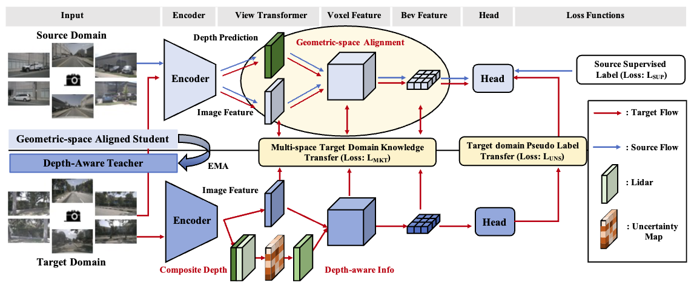

## BEVUDA: Multi-geometric Space Alignments for Domain Adaptive BEV 3D Object Detection [**[Paper]**](https://arxiv.org/pdf/2211.17126)
Jiaming Liu*, Rongyu Zhang*, Xiaoqi Li, Xiaowei Chi, Zehui Chen, Ming Lu, Yandong Guo, Shanghang Zhang



## Quick Start
### Installation
**Step 0.** Install [pytorch](https://pytorch.org/)(v1.9.0).

**Step 1.** Install [MMDetection3D](https://github.com/open-mmlab/mmdetection3d)(v1.0.0rc4).

**Step 2.** Install requirements.
```shell
pip install -r requirements.txt
```
**Step 3.** Install BEVDepth(gpu required).
```shell
python setup.py develop
```

### Data preparation
**Step 0.** Download nuScenes official dataset.

**Step 1.** Symlink the dataset root to `./data/`.
```
ln -s [nuscenes root] ./data/
```
The directory will be as follows.
```
BEVDepth
├── data
│   ├── nuScenes
│   │   ├── maps
│   │   ├── samples
│   │   ├── sweeps
│   │   ├── v1.0-test
|   |   ├── v1.0-trainval
```
**Step 2.** Prepare infos.
```
python scripts/gen_info.py
```

### Tutorials
**Train.**
```
python [EXP_PATH] --amp_backend native -b 8 --gpus 8
```
**Eval.**
```
python [EXP_PATH] --ckpt_path [CKPT_PATH] -e -b 8 --gpus 8
```

## Cite BEVUDA
If you use BEVDepth in your research, please cite our work by using the following BibTeX entry:

```latex
@article{liu2022multi,
  title={Multi-latent Space Alignments for Unsupervised Domain Adaptation in Multi-view 3D Object Detection},
  author={Liu, Jiaming and Zhang, Rongyu and Chi, Xiaowei and Li, Xiaoqi and Lu, Ming and Guo, Yandong and Zhang, Shanghang},
  journal={arXiv preprint arXiv:2211.17126},
  year={2022}
}
```
